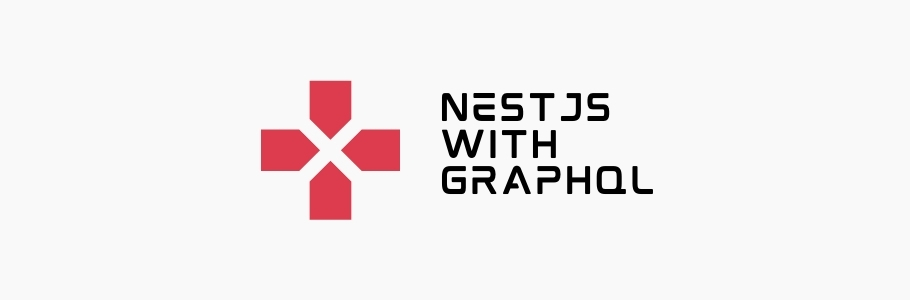

[](https://github.com/danilo-righetto/nestjs-with-graphql/)

<p align="center">
<a href="https://github.com/danilo-righetto/nestjs-with-graphql/stargazers"></a>
  <a href="https://github.com/danilo-righetto/nestjs-with-graphql/commits/master">
    
  </a>
    <a href="https://github.com/danilo-righetto/nestjs-with-graphql/issues">
    
  </a>
    <a href="https://github.com/danilo-righetto/nestjs-with-graphql/pulls">
    
  </a>
    <a href="https://github.com/danilo-righetto/nestjs-with-graphql/blob/master/LICENSE">
    
  </a>
</p>

# NestJS with GraphQL

[](https://github.com/danilo-righetto/nestjs-with-graphql/blob/master/LICENSE.md)

> :rocket: Creating a REST API with NestJS and GraphQL.

## About the project 

Working with [NestJS](https://nestjs.com/) for APIs.

## Run the project locally

Use this command to start the project with NestJS:
```sh
$ npm run start
```

## Versioning

To keep better organization of releases we follow the [Semantic Versioning 2.0.0](http://semver.org/) guidelines.

## Contributing

To contribute to the project see: [CONTRIBUTING.md](https://github.com/danilo-righetto/nestjs-with-graphql/blob/master/CONTRIBUTING.md)

## License
[MIT License](https://github.com/danilo-righetto/nestjs-with-graphql/blob/master/LICENSE.md) © [Danilo Righetto](https://www.danilorighetto.com.br/)